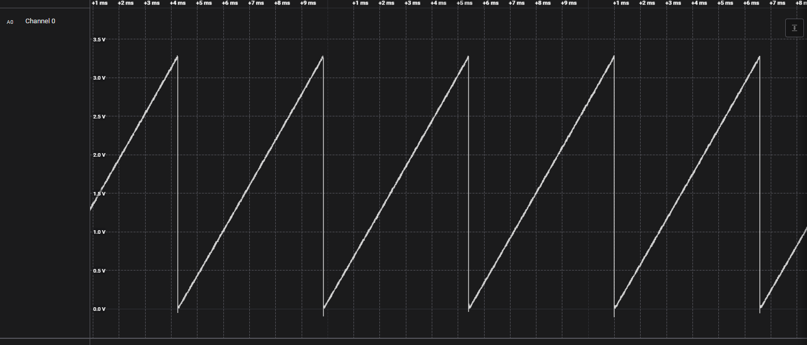

# Sawtooth Wave Generator using MCP41010 Digital Potentiometer

## Description

This project generates a **sawtooth waveform** using the **MCP41010** SPI digital potentiometer, driven entirely by interrupts on the TM4C1294NCPDT microcontroller — no polling or busy-waiting in the main loop.

The waveform is produced by continuously ramping the potentiometer's wiper value (0–255) through an interrupt-driven closed loop between **Timer3** and **SSI0**:

1. **Timer3** is configured in periodic mode. On every timeout, its interrupt handler increments the wiper setpoint and triggers an SPI transfer to the MCP41010 (command byte + new wiper value).
2. **SSI0** sends the command/data byte pair. When the transmission completes (TX FIFO empty / last bit shifted out), the SSI0 interrupt handler fires and **reloads/restarts Timer3**, scheduling the next increment.
3. This handoff between Timer3 → SSI0 → Timer3 repeats continuously. Since the wiper value wraps from `0xFF` back to `0x00`, the resulting output voltage ramps up and resets, forming the characteristic **sawtooth shape**. The ramp rate is controlled by the Timer3 reload value, and the step size is controlled by the wiper increment per cycle.


## Waveform



## Hardware

- **Microcontroller:** TM4C1294NCPDT (Tiva C Series)
- **Board:** *(e.g. EK-TM4C1294XL LaunchPad, or your custom board)*
- **Digital potentiometer:** MCP41010 (single-channel, 8-bit, 10 kΩ, SPI interface)


### MCP41010 command protocol

Each update sends **two bytes** over SPI:

1. **Command byte** — `0x11` selects the *write* command targeting the single wiper channel (potentiometer 0).
2. **Data byte** — the new wiper value, `0x00`–`0xFF`.

`CS` (Chip Select) must be held low for both bytes of the transfer and released afterward, per the MCP41010 datasheet.

## Requirements

- **Code Composer Studio (CCS)**
  Download from [TI Code Composer Studio](https://www.ti.com/tool/CCSTUDIO).

- **TivaWare for C Series (TI's peripheral SDK)**
  This project does **not** rely on the auto-detected `${COM_TI_TIVAWARE_INSTALL_DIR}` CCS variable. Instead, you must point the project manually to wherever you install TivaWare on your machine:

  1. Download/install **TivaWare for C Series** ([TI TivaWare product page](https://www.ti.com/tool/SW-TM4C)).
  2. In CCS, open your project's **Properties**.
  3. Go to **Build → ARM Compiler → Include Options**, and add the path to TivaWare's `inc` (and `driverlib` if used) folder, e.g.:
     ```
     C:\ti\TivaWare_C_Series-2.2.0.295
     ```
  4. Go to **Build → ARM Linker → File Search Path**, and add the same TivaWare root folder.
  5. Rebuild the project.

  > Adjust the exact path to match wherever you installed TivaWare on your system — the steps above use an example Windows path.

## Cloning and importing the project

1. Clone the repository:
   ```bash
   git clone <repo-url>
   ```

2. In CCS: `Project` → `Import CCS Projects...`

3. Browse to the cloned folder, select the project, click `Finish`.

4. Configure the TivaWare paths as described above (**Include Options** and **File Search Path**).

5. Right-click the project → `Build Project`.

## Flashing / Debugging

1. Connect your board via USB.
2. Right-click the project → `Debug As` → `Code Composer Studio Debug Session`.
3. This builds (if needed), flashes the binary, and opens a debug session.

## Project structure

```
.
├── main.c                        # Entry point / peripheral init
├── tm4c1294ncpdt.cmd              # Linker command file
├── tm4c1294ncpdt_startup_ccs.c    # Startup code / interrupt vector table
├── targetConfigs/                 # Debugger configuration (.ccxml)
├── .project / .cproject           # CCS project metadata
└── README.md
```

## Notes

- `Debug/` and `Release/` folders are not version-controlled (see `.gitignore`); they are regenerated automatically on build.
- Line endings are normalized to LF via `.gitattributes`.
